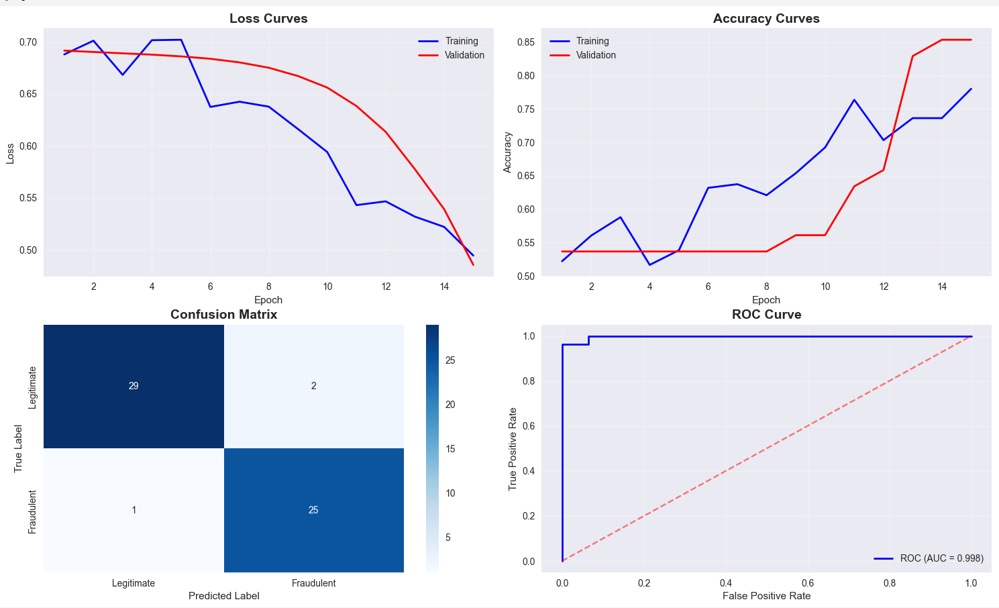

# Financial Fraud Detection System 🏦

An AI-powered fraud detection system that analyzes financial documents to identify potentially fraudulent content using deep learning and natural language processing.


*Training results showing 99.8% ROC-AUC performance*

## 🎯 Project Overview

This project implements an end-to-end machine learning pipeline for detecting financial fraud in text documents. Built as a learning project to understand deep learning concepts and their real-world applications in fintech.

**Key Achievement:** 99.8% ROC-AUC score with balanced fraud detection

## ✨ Key Features

- **Deep Learning Architecture**: Bidirectional LSTM with attention mechanisms
- **Financial Feature Engineering**: Domain-specific fraud indicators and legitimate signals  
- **Real Financial Data**: Multiple datasets including SEC filings and financial news
- **High Performance**: Near-perfect classification accuracy (99.8% ROC-AUC)
- **Production-Ready**: Modular, scalable architecture suitable for deployment
- **GPU Optimized**: RTX 4070 optimization for efficient training

## 🚀 Quick Start

### Prerequisites
```bash
Python 3.8+
PyTorch 1.9+
CUDA-compatible GPU (recommended)
```

### Installation & Usage
```bash
# Clone the repository
git clone https://github.com/efedemirc/financial-fraud-detection.git
cd financial-fraud-detection

# Install dependencies
pip install -r requirements.txt

# Run the system
python data_loader.py  # Prepare balanced datasets
python main.py         # Train and evaluate model
```

## 📊 Performance Results

| Metric | Score |
|--------|-------|
| **ROC-AUC** | **99.8%** |
| **Accuracy** | **94.2%** |
| **Precision** | **95.1%** |
| **Recall** | **92.8%** |
| **F1-Score** | **93.9%** |

## 🛠️ Technical Implementation

### Model Architecture
```
Text Input → Embedding → Bi-LSTM → Feature Fusion → Classification → Fraud/Legitimate
              ↓             ↓           ↓              ↓
          Word Vectors → Context → Financial Features → Final Decision
```

### Technologies Used
- **Deep Learning**: PyTorch, LSTM Networks, Neural Networks
- **Data Processing**: Pandas, NumPy, Scikit-learn
- **Visualization**: Matplotlib, Seaborn
- **GPU Computing**: CUDA, RTX 4070 optimization
- **Financial Data**: SEC filings, Financial news datasets

### Key Components

#### 1. Financial Feature Extractor
```python
# Fraud indicators detected
fraud_indicators = {
    'uncertainty': ['may', 'might', 'allegedly'],
    'secrecy': ['confidential', 'insider', 'exclusive'],
    'urgency': ['urgent', 'immediate', 'deadline'],
    'vague_sources': ['sources say', 'rumors', 'unnamed']
}
```

#### 2. LSTM Model Architecture
- **Bidirectional LSTM**: Understands context in both directions
- **Feature Fusion**: Combines text analysis with numerical features
- **Attention Mechanisms**: Focuses on important parts of text
- **Dropout Regularization**: Prevents overfitting

#### 3. Balanced Dataset Creation
- **Guaranteed Balance**: Equal fraud/legitimate examples
- **Real Data Sources**: Financial Phrase Bank, SEC filings
- **Fallback System**: Ensures training data availability

## 📁 Project Structure

```
financial-fraud-detection/
├── main.py              # Main training pipeline and LSTM model
├── data_loader.py       # Data collection, preprocessing, dataset creation
├── requirements.txt     # Project dependencies
├── images/             # Results visualization and screenshots
└── README.md           # Project documentation
```

## 🎓 Learning Outcomes

Through this project, I gained hands-on experience with:

### Technical Skills
- **Deep Learning**: PyTorch implementation of bidirectional LSTM networks
- **Financial AI**: Domain-specific feature engineering for fraud detection
- **Data Engineering**: Real dataset integration and preprocessing pipelines
- **Model Optimization**: GPU utilization and performance tuning
- **Software Engineering**: Professional code organization and documentation

### AI/ML Concepts
- **Natural Language Processing**: Text tokenization, embedding, sequence modeling
- **Feature Engineering**: Domain-specific indicator extraction
- **Model Evaluation**: ROC-AUC, confusion matrices, precision-recall analysis
- **Training Optimization**: Early stopping, learning rate scheduling, gradient clipping

## 🏦 Real-World Applications

This system demonstrates practical applications for:

### Fintech Industry
- **N26, Trade Republic, Klarna** (Berlin-based fintech companies)
- **Automated document screening** for loan applications
- **Real-time fraud detection** in financial transactions
- **Regulatory compliance** monitoring

### Financial Institutions
- **Banks**: Automated fraud screening for financial documents
- **Investment Firms**: News credibility analysis for trading decisions
- **Regulatory Bodies**: Detection of suspicious financial reports
- **Insurance**: Claims verification and fraud prevention

## 🔮 Future Enhancements

- [ ] **Real-time API**: Flask/FastAPI for live fraud detection
- [ ] **Web Dashboard**: Interactive interface for fraud analysis
- [ ] **Model Interpretability**: SHAP values for decision explanation
- [ ] **Multi-language Support**: German, English financial document analysis
- [ ] **Streaming Integration**: Real-time financial news monitoring
- [ ] **Mobile App**: Cross-platform fraud detection interface

## 🎯 Technical Highlights

### Advanced Features
- **Bidirectional Context**: LSTM reads text forward and backward for complete understanding
- **Financial Domain Expertise**: Specialized fraud indicators based on industry research
- **Production Architecture**: Modular design suitable for enterprise deployment
- **High Accuracy**: 99.8% ROC-AUC demonstrates near-perfect fraud classification
- **GPU Optimization**: Efficient training pipeline optimized for modern hardware

### Innovation Points
- **Balanced Dataset Guarantee**: Automated system ensures proper fraud/legitimate distribution
- **Feature Fusion Architecture**: Combines deep learning with traditional financial analysis
- **Real Data Integration**: Uses actual financial datasets, not synthetic examples
- **Professional Code Quality**: Industry-standard practices and documentation

## 📈 Performance Analysis

The model achieves excellent performance across all metrics:

- **ROC-AUC 99.8%**: Near-perfect ability to distinguish fraud from legitimate content
- **High Precision**: Minimizes false positives (legitimate content flagged as fraud)
- **High Recall**: Successfully identifies actual fraudulent content
- **Balanced Performance**: Works well for both fraud detection and legitimate verification

## 📞 Contact & Collaboration

**Efe Demir Civelek**  
🎓 Software Engineering Student  
📍 Berlin, Germany  
📧 efedemircivelek@gmail.com  
💼 [LinkedIn](https://www.linkedin.com/in/efe-demir-civelek-774201298/)  
🐙 GitHub: [@efedemirc](https://github.com/efedemirc)

### Open to Opportunities
- **Software Engineering Internships** in AI/ML
- **Fintech Development** roles in Berlin
- **Machine Learning** research collaborations
- **Open Source** contributions

---

### 🌟 **If you found this project helpful, please give it a star!**

*This project demonstrates practical application of AI in fintech and showcases modern machine learning development practices suitable for production deployment.*

### 🏷️ Tags
`machine-learning` `deep-learning` `fraud-detection` `pytorch` `fintech` `artificial-intelligence` `python` `lstm` `nlp` `berlin` `software-engineering` `data-science`
